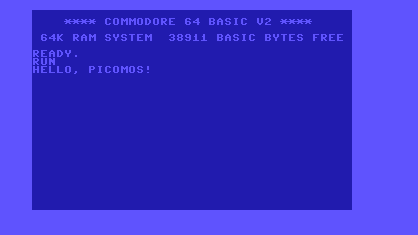

# picomos

[](https://github.com/johnwbyrd/picomos/releases/tag/nightly)
[](https://github.com/johnwbyrd/picomos/actions/workflows/release.yml)
[](LICENSE)
[](https://github.com/johnwbyrd/picomos/releases)

A batteries-included cross-development SDK for MOS 6502-family targets.
One directory contains a full [llvm-mos](https://llvm-mos.org/) toolchain,
a [picolibc](https://github.com/picolibc/picolibc) sysroot, per-machine
overlays (linker script, startup, I/O), and clang config files. You invoke
the compiler normally:

```sh
mos-clang --config=$PICOMOS/share/picomos/configs/picomos-c64.cfg \
          hello.c -o hello.prg
```

No picomos-specific tools. No shell wrappers around clang. Nothing on your
PATH except what you extracted from the tarball.



*picomos-built PRG running on MAME's `c64` driver — `puts()` → picolibc
stdio hook → KERNAL CHROUT → screen.*

> **Status: pre-release.** No versioned tag has been cut yet, but every
> push to `main` produces a rolling `nightly` bundle for each host —
> pull it from
> [github.com/johnwbyrd/picomos/releases/tag/nightly](https://github.com/johnwbyrd/picomos/releases/tag/nightly)
> (or use the direct URLs in [Quick start](#quick-start) below). Contents
> change on every push; the URLs stay the same.

## Contents

- [Why picomos?](#why-picomos)
- [Supported hosts and targets](#supported-hosts-and-targets)
- [Quick start](#quick-start)
- [What's in the SDK](#whats-in-the-sdk)
- [Building your program](#building-your-program)
- [Running under an emulator](#running-under-an-emulator)
- [Troubleshooting](#troubleshooting)
- [How it fits together](#how-it-fits-together)
- [Building the SDK yourself](#building-the-sdk-yourself)
- [License](#license)

## Why picomos?

- **vs [cc65](https://cc65.github.io/):** cc65 is the classic 6502 C
  toolchain and its runtime library is excellent, but its compiler
  is pre-C99 with limited optimization. picomos pairs the full
  [llvm-mos](https://llvm-mos.org/) LLVM backend for 6502 — modern C
  (through C23), whole-program LTO, and clang-syntax inline asm.
- **vs [llvm-mos-sdk](https://github.com/llvm-mos/llvm-mos-sdk):**
  llvm-mos-sdk bundles llvm-mos with a lightweight cc65-derived libc.
  picomos bundles llvm-mos with **picolibc** instead — a
  standards-conformant C library with proper `<stdio.h>`, `<math.h>`,
  floating-point, and hookable TinyStdio. Better fit when you want the
  C standard library on a 6502.
- **vs "just build llvm-mos + picolibc yourself":** you can, and it
  takes 2-3 hours plus a stack of config-file plumbing to get a working
  hello-world. picomos does the plumbing once, ships a self-contained
  directory that "just works" on Linux, macOS, and Windows, and gives
  you `find_package(Picomos)` for CMake plus `ctest` support out of
  the box.

## Supported hosts and targets

| Host                    | Bundle format         |
|-------------------------|-----------------------|
| Linux x86_64 / aarch64  | `.tar.xz`             |
| macOS arm64 / x86_64    | `.tar.xz`             |
| Windows x86_64          | `.zip`                |

| Target machine       | Emulator (runner)              | Output |
|----------------------|--------------------------------|--------|
| `zbc`                | MAME driver `zbcm6502`         | ELF    |
| `c64` — Commodore 64 | MAME driver `c64` (needs ROMs) | PRG    |

Each bundle is host-specific (compiler binaries) but contains all target
machines — one download builds for every machine picomos supports.

## Quick start

First, install MAME — the SDK does not bundle it:

| Platform         | Command                                      |
|------------------|----------------------------------------------|
| Ubuntu / Debian  | `sudo apt install mame`                      |
| Fedora           | `sudo dnf install mame`                      |
| macOS (Homebrew) | `brew install mame`                          |
| Windows          | `winget install MameDev.MAME` — or grab an installer from [mamedev.org/release.html](https://mamedev.org/release.html) |

Then:

<details open>
<summary><b>Linux / macOS (bash)</b></summary>

```sh
# 1. Download and extract the current nightly bundle for your host
#    (macOS: swap in picomos-nightly-macos-arm64.tar.xz)
curl -LO https://github.com/johnwbyrd/picomos/releases/download/nightly/picomos-nightly-linux-x86_64.tar.xz
tar xf picomos-nightly-linux-x86_64.tar.xz
export PICOMOS=$PWD/picomos-nightly-linux-x86_64
export PATH=$PICOMOS/bin:$PATH

# 2. Write hello world
cat > hello.c <<'EOF'
#include <stdio.h>
int main(void) { puts("hello, mos"); return 0; }
EOF

# 3. Build for the C64 (produces a Commodore PRG directly — no objcopy)
mos-clang --config=$PICOMOS/share/picomos/configs/picomos-c64.cfg \
          hello.c -o hello.prg

# 4. Run under MAME's c64 driver. The bundled lua plugin auto-types RUN
#    once the KERNAL reaches READY and mirrors every CHROUT byte to the
#    terminal, so you see "hello, mos" on host stdout as well as in the
#    emulator window. Requires Commodore's BASIC/KERNAL/character ROMs
#    in your MAME romset — see Troubleshooting if MAME complains.
mame c64 -window -skip_gameinfo \
    -quik hello.prg \
    -plugins -autoboot_script \
        $PICOMOS/mos-elf/usr/share/picomos/machines/c64/runner-mame.lua \
    -seconds_to_run 10
```

</details>

<details>
<summary><b>Windows (PowerShell)</b></summary>

```powershell
# 1. Download and extract the current nightly bundle
Invoke-WebRequest `
    -Uri https://github.com/johnwbyrd/picomos/releases/download/nightly/picomos-nightly-windows-x86_64.zip `
    -OutFile picomos.zip
Expand-Archive picomos.zip
$env:PICOMOS = "$PWD\picomos-nightly-windows-x86_64"
$env:PATH    = "$env:PICOMOS\bin;$env:PATH"

# 2. Write hello world
@'
#include <stdio.h>
int main(void) { puts("hello, mos"); return 0; }
'@ | Set-Content hello.c

# 3. Build for the C64 (produces a Commodore PRG directly — no objcopy)
mos-clang --config=$env:PICOMOS\share\picomos\configs\picomos-c64.cfg `
          hello.c -o hello.prg

# 4. Run under MAME's c64 driver. The bundled lua plugin auto-types RUN
#    and mirrors every CHROUT byte to the terminal. Requires Commodore's
#    BASIC/KERNAL/character ROMs in your MAME romset — see
#    Troubleshooting if MAME complains.
mame c64 -window -skip_gameinfo `
    -quik hello.prg `
    -plugins -autoboot_script `
        $env:PICOMOS\mos-elf\usr\share\picomos\machines\c64\runner-mame.lua `
    -seconds_to_run 10
```

</details>

Output appears both in the MAME window (as the C64 renders it via the
KERNAL screen editor) and on the host terminal (via the bundled lua
plugin's CHROUT tap). To try the semihost-only `zbc` machine instead
— no ROMs required, output on host stdout only — swap `c64` → `zbc`,
`.prg` → `.elf`, and the MAME line to:

```sh
mame zbcm6502 -window -skip_gameinfo -elfload hello.elf -seconds_to_run 5
```

If you're using CMake, the [CMake workflow](#cmake) below gives you a
`run-hello` build target that invokes MAME for you — no bash script, no
hand-typed emulator flags.

## What's in the SDK

```text
picomos-X.Y.Z-<host>/
├── bin/                       host toolchain — mos-clang, mos-clang++,
│                              clang, ld.lld, llvm-ar, llvm-nm, ...
├── lib/                       compiler-rt for mos-unknown-unknown +
│                              LLVM shared/dev libraries
├── mos-elf/                   THE SYSROOT
│   └── usr/
│       ├── include/           picolibc headers (stdio.h, stdlib.h, ...)
│       ├── lib/               picolibc libc.a, libm.a, crt0 variants
│       └── share/picomos/
│           └── machines/      per-machine overlay
│               ├── zbc/       link.ld, runners.cmake
│               ├── nes/       link.ld, crt0.o, libio.a, runners.cmake,
│               │              runner-mame.lua
│               └── c64/       link.ld, crt0.o, libio.a, runners.cmake,
│                              runner-mame.lua
└── share/picomos/
    ├── configs/               clang config files (--config= consumes)
    │   ├── picomos-zbc.cfg
    │   └── picomos-c64.cfg
    ├── cmake/                 PicomosConfig.cmake + mos-toolchain.cmake
    │                          for find_package(Picomos) / cross-compile
    └── examples/              copyable example projects
        ├── programs/          portable (fanned out across every machine)
        │   ├── hello/         minimal puts()
        │   └── malloc_free/   picolibc malloc + free
        └── <machine>/         per-machine (target-only demos)
```

Every path in the `.cfg` files is relative to the config file's location
(via clang's `<CFGDIR>` macro), so you can extract the tarball to any path
— including USB sticks, network drives, or per-project directories — and
things still resolve.

## Building your program

Two workflows, both portable across Linux, macOS, Windows.

### Direct compiler

```sh
mos-clang --config=$PICOMOS/share/picomos/configs/picomos-<machine>.cfg \
          main.c -o hello.<ext>
```

Output extension depends on the machine: `.elf` for ZBC (bare ELF for the
semihost host loader), `.prg` for C64 (Commodore PRG with a BASIC `SYS`
launcher; the linker script emits raw PRG format directly — no `objcopy`
step needed).

### CMake

```cmake
cmake_minimum_required(VERSION 3.24)
project(hello LANGUAGES C)

find_package(Picomos REQUIRED)

picomos_add_executable(hello
    MACHINE c64            # or zbc
    SOURCES main.c)

# Optional: adds a `run-hello` target that launches MAME on the built
# binary. Cross-platform (pure CMake, no shell script). Override the
# emulator binary via the PICOMOS_MAME environment variable.
picomos_run(hello TIMEOUT 10)

# Automated check: `ctest` runs the same emulator invocation and
# passes if "hello, mos" appears in the captured output stream.
# Under c64, that stream is CHROUT bytes intercepted via a memory
# tap on $FFD2; under zbc, it's the semihost writes MAME's zbcm6502
# driver already routes to stdout. Either way, one API.
enable_testing()
picomos_add_test(hello EXPECT "hello, mos" TIMEOUT 10)
```

Configure with picomos's own toolchain file so CMake probes with
`mos-clang` instead of the host cc:

```sh
cmake -B build -G Ninja \
    -DCMAKE_TOOLCHAIN_FILE=$PICOMOS/share/picomos/cmake/mos-toolchain.cmake \
    -DPicomos_DIR=$PICOMOS/share/picomos/cmake
cmake --build build                       # builds hello.prg (or hello.elf)
cmake --build build --target run-hello    # launches MAME on it
```

`picomos_add_executable` expands to the same `--config=picomos-<machine>.cfg`
invocation as the direct-compiler workflow — the CMake path is purely
ergonomic (dependency tracking, cross-platform, and `run-hello` targets
without touching a shell).

Complete copyable projects live under `share/picomos/examples/`.

## Running under an emulator

The SDK does **not** bundle MAME — install it separately (`apt install mame`,
`brew install mame`, or your platform's equivalent).

- **ZBC (`zbcm6502` driver)** — no external ROMs required; the driver is
  self-contained. semihost stdio prints to the host terminal. Clean exit
  via `sys_exit`.
- **Commodore 64 (`c64` driver)** — requires Commodore's original
  BASIC/KERNAL/character ROMs in your MAME romset. MAME will report the
  exact filenames it looked for if any are missing. Output appears on the
  emulated C64 screen (not the host terminal).

Override the MAME binary with the `PICOMOS_MAME` environment variable
when using the CMake `picomos_run` target — set it on the `cmake -B`
configure line, not on `cmake --build`, since the resolved path is
baked into the custom target at configure time. Or invoke MAME directly
with its full path if you prefer. Which emulators each machine supports is
declared via `picomos_emulator()` calls in
[`machines/<name>/machine.cmake`](machines/); the design allows plural
emulators per machine (`picomos_run(hello EMULATOR vice)` is intended
to work once vice runners land — currently only MAME is verified).

## Troubleshooting

**MAME says `901226-01.u3 NOT FOUND` (or similar `.uXX` file names).**
You're missing Commodore's original ROMs — MAME needs the C64
BASIC/KERNAL/character ROMs in a `c64.zip` under its `rompath`. MAME
lists the exact filenames it looked for. Legitimate sources include
CBM's own redistribution license, or dumps from your own hardware. The
`zbc` machine needs no external ROMs.

**`mame: command not found`.** Install MAME per the
[Quick start](#quick-start) table. If it's installed to a non-standard
path, either add it to `PATH` or point picomos at it directly — note
that `PICOMOS_MAME` is read at CMake **configure** time, not build time,
so set it on the `cmake -B` line:

```sh
PICOMOS_MAME=/opt/mame/mame cmake -B build -G Ninja \
    -DCMAKE_TOOLCHAIN_FILE=$PICOMOS/share/picomos/cmake/mos-toolchain.cmake \
    -DPicomos_DIR=$PICOMOS/share/picomos/cmake
cmake --build build --target run-hello
```

**MAME can't find its ROMs even though they're on disk.** MAME searches
its default `rompath` (`~/.mame/`, `/usr/share/mame/roms/`, ...). A
self-built MAME typically keeps its ROMs under its own source dir and
has no default rompath — either `cd` into that dir before invoking
`cmake --build`, or pass an explicit rompath via `picomos_run`'s
`EXTRA_ARGS`:

```cmake
picomos_run(hello TIMEOUT 10 EXTRA_ARGS -rompath /path/to/mame/roms)
```

**macOS: "cannot verify developer" / "…is damaged and can't be opened".**
picomos binaries are unsigned; Gatekeeper quarantines them on
first-run. Strip the quarantine bit after extraction:

```sh
xattr -dr com.apple.quarantine picomos-nightly-macos-arm64/
```

**Windows: `ninja: not found` from CMake.** Install ninja
(`winget install Kitware.Ninja`) or install CMake with the "add to
PATH" option — modern CMake installers bundle ninja.

**Windows: `mos-clang: not found` after extraction.** PowerShell's
`Expand-Archive` sometimes drops execute permissions or preserves the
inner `picomos-nightly-windows-x86_64\` folder inside another folder.
Double-check `$env:PICOMOS\bin\mos-clang.exe` actually exists and that
`$env:PATH` was set with a backslash: `"$env:PICOMOS\bin;$env:PATH"`.

**Linker error `undefined reference to _start` / `cannot find -lc`.**
The `--config=picomos-<machine>.cfg` flag wasn't passed, or `$PICOMOS`
is wrong. Sanity check:

```sh
ls $PICOMOS/share/picomos/configs/         # should list picomos-*.cfg
$PICOMOS/bin/mos-clang --version           # should print "Target: mos"
```

**c64 program runs but the terminal shows only the KERNAL banner (no
program output).** The bundled `runner-mame.lua` mirrors CHROUT
(`$FFD2`) to the terminal — if your program writes directly to screen
RAM (`*(volatile char*)0x0400 = 'H'`) instead of going through
`puts()` / `printf()`, the bytes never pass through CHROUT and won't
appear in the captured stream. Look at the MAME window itself in that
case.

**`ctest` says "No tests were found!!!".** `enable_testing()` must be
called *before* `find_package(Picomos)` and any `picomos_add_test()`
invocation in your `CMakeLists.txt`.

## How it fits together

- **llvm-mos** — the compiler + linker. `mos-clang` is llvm-mos's clang
  driver with the `mos-unknown-unknown` triple baked in.
- **picolibc** — the C library. picomos uses the
  [johnwbyrd/picolibc](https://github.com/johnwbyrd/picolibc) fork on
  branch `feature/upstream-rebase-2026-09`; MOS support is not yet in
  upstream picolibc.
- **Machine overlays** — small per-machine bundles that plug into the
  picolibc-based sysroot. Each contributes some subset of a linker script,
  startup code, and I/O backend. See `mos-elf/usr/share/picomos/machines/<name>/README.md`
  for the anatomy of a specific overlay.
- **Clang config files** — one per machine. They set `--sysroot`,
  `-isystem`, `-L`, and any per-machine extras so end users just say
  `--config=picomos-<machine>.cfg`.

## Building the SDK yourself

Only interesting if you want to produce a new bundle or hack on picomos
itself. Requirements: CMake ≥ 3.24, Ninja, git, meson (for the picolibc
step; Linux only). Bring some patience — llvm-mos-from-source dominates
the build time.

```sh
git clone https://github.com/johnwbyrd/picomos
cd picomos
cmake -B build -G Ninja \
    -DPICOMOS_LLVM_MOS_REF=main \
    -DPICOMOS_INSTALL_TOOLCHAIN=ON
cmake --build build                              # ~1 hour on 16 cores
cmake --build build --target package             # produces picomos-*.tar.xz / .zip
```

Fast local iteration (skip llvm-mos build, reuse an existing tree):

```sh
cmake -B build -G Ninja \
    -DPICOMOS_LLVM_MOS_ROOT=/path/to/existing/llvm-mos/install
cmake --build build
cmake --install build --prefix ./stage
```

Every subdirectory of `machines/` with a `machine.cmake` that declares
a non-abstract machine is built by default. Restrict to a subset with
e.g. `-DPICOMOS_MACHINES=zbc`.

Full CMake option reference lives at the top of
[CMakeLists.txt](CMakeLists.txt). The CI matrix that produces the shipped
bundles is [.github/workflows/release.yml](.github/workflows/release.yml).

### Adding a new machine

Copy `machines/zbc/` or `machines/nes/` as a starting point and adjust:

- `machine.cmake` — the single source of truth per machine.
  `picomos_machine(<name> DISPLAY_NAME ... CPU ... MEMORY_MAP ...)`
  registers the machine; one or more `picomos_emulator(<name> <emul> ...)`
  calls declare how to run it. `INHERITS <parent>` pulls sources and
  metadata from an abstract base machine — see
  [`machines/cbm/`](machines/cbm/) for a worked example (c64 inherits
  from it and drops all the shared PETSCII/CHROUT/BASIC-loader pieces).
- `linker/memory.ld` + `linker/sections.ld` — memory map and section
  layout. Auto-discovered.
- `crt/*.[cS]` — machine startup, only if picolibc's shipped crt0
  variants don't fit. Auto-discovered.
- `io/*.[cS]` — machine I/O backend, only if you need one beyond
  picolibc's semihost. Auto-discovered.
- `runner-mame.lua` (or `runner-<emulator>.lua`/`.py`) — optional MAME
  Lua plugin, referenced from a `picomos_emulator()` call.

The new machine's directory is auto-discovered by picomos's top-level
`machines/CMakeLists.txt` and lands in the SDK bundle alongside the
existing targets — no top-level edit needed. Use
`-DPICOMOS_MACHINES=<subset>` if you want to exclude it from a build.

## License

picomos itself is [BSD-3-Clause](LICENSE) — matching picolibc's core
license so downstream bundling doesn't add friction. Bundled components
carry their own licenses (llvm-mos is Apache-2.0 WITH LLVM-exception,
picolibc is a mix of permissive BSD-style licenses inherited from
newlib); see [LICENSE](LICENSE) for the full attribution list.
